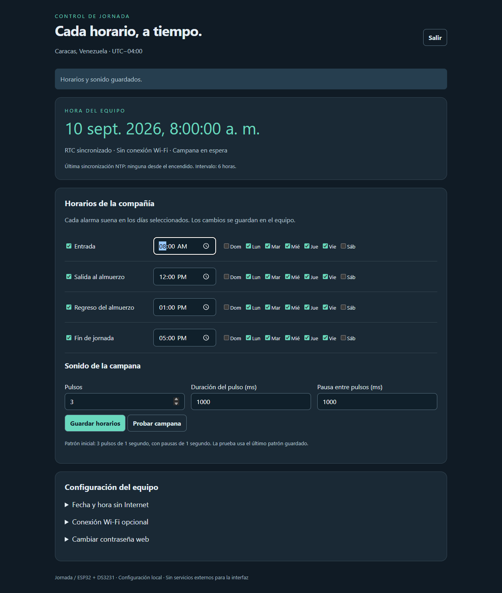

# ESP32 Company Bell Scheduler — ESP-IDF, DS3231, NTP & Web Configuration

**Jornada** is an offline-capable company bell scheduler built for an ESP32-WROOM DevKit, a DS3231 battery-backed real-time clock, and an SSR-controlled electric bell. It marks the start of work, lunch break, return from lunch, and end of the working day.

[Guía completa en español](README.es.md) · [Password recovery / Recuperar acceso](RECUPERAR-ACCESO.md) · [Verification report](VERIFICACION.md)

## Design and implementation credits

**[Jhonsep](https://github.com/Jhonsep) designed the solution and defined its requirements, hardware, schedules, and intended behavior. OpenAI Codex implemented the firmware, web interface, documentation, and desktop tests as an exercise to evaluate its software-development capabilities.** This repository documents that human-designed, AI-implemented experiment, including its verification results and remaining hardware checks.

## What it does

- Four independently enabled alarms with editable times and days of the week.
- Default Monday–Friday schedule: **08:00**, **12:00**, **13:00**, and **17:00**.
- Caracas, Venezuela time zone: **UTC−04:00**. The DS3231 stores UTC.
- Offline timekeeping using the DS3231, with periodic clock checks and NTP synchronization every six hours when Internet access is available.
- A responsive Spanish-language web interface served entirely by the ESP32, without a CDN or cloud backend.
- Optional Wi-Fi configuration through a persistent, WPA2-protected access point.
- Separate web and access-point passwords, session expiration, and physical password recovery using BOOT.
- Configurable bell pattern: three one-second pulses, separated by one-second pauses by default.
- Persistent firing records to prevent duplicate alarms after resets or backward clock changes. Missed alarms are skipped.
- A nonblocking extension point for a future programmable LED clock; the MVP requires no LED display.



## Hardware

| Part | Purpose / connection |
| --- | --- |
| ESP32-WROOM DevKit, 30 pins | Controller; ESP32 target, 4 MB flash build |
| DS3231 | Battery-backed RTC; SDA → GPIO21, SCL → GPIO22, VCC → 3V3, GND → GND |
| Single-channel SSR | Control input → GPIO25; active high by default |
| DINBELL 110 V AC electric bell | Audible workplace signal, switched through the SSR |
| BOOT button / GPIO0 | Hold for five seconds after startup to generate a new web password |

The DS3231's 32K and SQW pins are unused. GPIO assignments and SSR polarity can be changed under **Jornada - hardware** in `menuconfig`. GPIO0 is reserved for recovery in the default configuration.

The SSR's supply and mains wiring depend on the actual module. Use an appropriate inactive bias on its control input during reset and have the mains installation handled by qualified personnel. The software does not certify the bell's acoustic coverage or switching hardware.

## Build and flash

The firmware has been compiled with **ESP-IDF 5.0.1** for the classic ESP32. Open an ESP-IDF 5.0.1 terminal in the repository root:

```sh
idf.py build
idf.py -p YOUR_SERIAL_PORT flash monitor
```

The included Windows helper uses an existing installation under `C:\Espressif`, changes the environment only in its child process, and does not install or update tools. Adjust its paths for a different installation:

```powershell
powershell.exe -ExecutionPolicy Bypass -File .\tools\idf.ps1 -Action build
powershell.exe -ExecutionPolicy Bypass -File .\tools\idf.ps1 -Action flash -Port COM3
powershell.exe -ExecutionPolicy Bypass -File .\tools\idf.ps1 -Action monitor -Port COM3
```

Prebuilt images and their checksums are in [firmware/](firmware/LEEME.md). They use the default GPIO assignments and a 4 MB flash layout.

## First use and password recovery

1. Connect to the `Jornada-XXXXXX` Wi-Fi network. Its individual AP password is printed in the serial monitor.
2. Open **http://192.168.4.1**. The **web password is different from the AP password**.
3. The first boot prints `CLAVE WEB INICIAL`. If you missed it, open the serial monitor, let the ESP32 finish starting, release BOOT, then hold BOOT for five seconds. Use the new 24-character password printed after `NUEVA CLAVE WEB:`.
4. Release BOOT and sign in. Set the clock manually or configure an optional 2.4 GHz Wi-Fi network for NTP synchronization.
5. Check the alarms and bell pattern. A saved Wi-Fi change takes effect after a deliberate restart from the web interface.

Password recovery preserves the schedules, Wi-Fi credentials, AP password, and firing records. It invalidates previous web sessions. **Do not erase flash to recover the web password.** Hold BOOT only after startup, without pressing EN/RESET.

## Timing and failure behavior

The scheduler fires only when it observes a normal transition into an alarm minute. It skips the partially elapsed startup minute and detected clock-correction minutes rather than ringing late. It records a firing in NVS before energizing the SSR; a power failure between those operations can lose an alert, but will not replay it at the next boot. Simultaneous alarms share one bell pattern.

An invalid RTC at startup suspends scheduled alarms until manual time setting or NTP succeeds. After acquiring valid time, the ESP32 can continue on its system clock if the RTC subsequently fails; the interface reports the fault. If an alarm was fired with an incorrectly future-dated clock, its stored firing record inhibits repeats until that time has been passed. See the [Spanish guide](README.es.md) for the complete behavior and commissioning checklist.

## Project structure

| Path | Responsibility |
| --- | --- |
| `main/main.c` | Startup, persisted settings, Wi-Fi, scheduler task, bell task |
| `main/clock_service.c` | DS3231 access, UTC/local time handling, SNTP integration |
| `main/scheduler.c` | Pure alarm eligibility rule |
| `main/web.c` / `main/index.html` | Authenticated JSON API and embedded interface |
| `main/recovery.c` / `main/recovery_button.c` | Physical password recovery and long-press state machine |
| `tests/` | Portable C tests and a browser test using a mocked API |
| `tools/` | Windows build helper |
| `firmware/` | Compiled images and SHA-256 checksums |

The future LED clock can replace the weak `display_tick(utc, valid)` function with a quick frame-queue operation and a dedicated driver task. The Arduino/FastLED `counter.h` reference informed the extension design but is not a dependency or part of this repository.

## Validation and limits

**Passed:** ESP-IDF 5.0.1 compilation; desktop C tests for alarm rules and BOOT long-press behavior; browser tests for login, alarm editing, request payloads, mobile layout, and logout using a mocked API.

**Not established by those tests:** live server behavior on the ESP32, physical RTC/SSR/bell operation, power-cut recovery, acoustic coverage, and end-to-end password recovery on the board. Refer to [VERIFICACION.md](VERIFICACION.md) for the recorded evidence. This is an MVP and an AI implementation experiment, not a claim of production qualification.

Portable C tests:

```sh
gcc -std=c11 -Wall -Wextra -Werror -I main main/scheduler.c tests/test_scheduler.c -o test_scheduler
./test_scheduler
gcc -std=c11 -Wall -Wextra -Werror -I main main/recovery_button.c tests/test_recovery_button.c -o test_recovery_button
./test_recovery_button
```

The web UI uses **local HTTP, not HTTPS**. Use the protected AP or a trusted management network; do not expose it to the Internet. Web passwords are salted SHA-256 hashes, while Wi-Fi credentials reside in unencrypted NVS. Flash encryption, secure boot, a slow password KDF, authenticated NTP, OTA, and historical audit logs are outside this MVP.

## Technical references

- [Analog Devices DS3231 datasheet](https://www.analog.com/media/en/technical-documentation/data-sheets/ds3231.pdf)
- [Espressif system time and SNTP documentation](https://docs.espressif.com/projects/esp-idf/en/v5.0.1/esp32/api-reference/system/system_time.html)
- [Espressif HTTP server documentation](https://docs.espressif.com/projects/esp-idf/en/v5.0.1/esp32/api-reference/protocols/esp_http_server.html)
